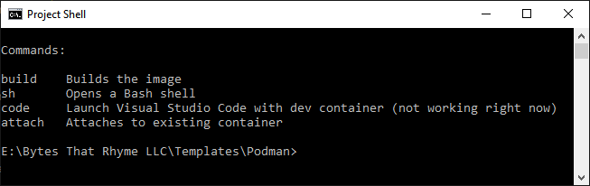
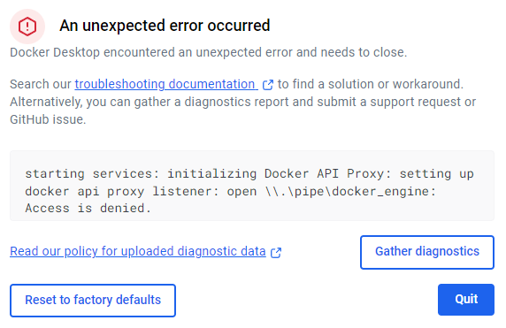

# Podman Container Template

This template repository offers a one-step build process for software that can run in a Linux container. Developers can use it to create cross-platform development experiences that require minimal setup work.

## Getting Started

  1. Edit the `Dockerfile` in the `container` directory.
  2. Edit the `scripts\config.cmd` directory to set the machine name and dev directory. Choose a unique machine name to avoid collisions with other machines, or choose an existing machine name to reduce usage of system resources.
  3. Open `shell.cmd`.
  4. Type `build` to build your container image.
  5. Type `sh` to create a temporary container based on your image, and run a shell inside of it. The container will be deleted once you exit the shell.

## Design

## Podman Instead of Docker

This repository uses Podman to manage containers, because Podman tends to be more reliable than Docker:

  - Podman in rootless mode doesn't use a privileged daemon that requires special access controls.
  - Podman doesn't require a centralized installation that can become corrupted over time.
  - Podman only occupies about 64 MB, plus about 8.9GB for its Linux installation on Windows Subsystem for Linux.

Here is an example of a Docker pipe permission error:

Notice that the dialog offers no way to circumvent or fix this error. Clicking **Reset to factory defaults** doesn't fix the problem, for example. [This Github issue](https://github.com/docker/for-win/issues/13663) is still open as of 2025-06-06, and is full of suggestions for fixes to try rather than concrete, reliable solutions. This issue doesn't mean that Docker is bad software, but rather that problems in complex software can be show-stoppers if all of the development environments on a given machine rely on that software. By using Podman, we can reduce this risk.

